# ROS2 Rover System Architecture

```mermaid
graph TB
    %% External Hardware Layer
    subgraph HW ["🔧 Hardware Layer"]
        VIPS["📡 VIPS Indoor Positioning System<br/>(Serial /dev/ttyUSB0)"]
        CAN_BUS["🚌 CAN Bus Interface<br/>(can0)"]
        MOTORS["⚙️ Motor Controllers<br/>(Steering & Drive)"]
        SERVOS["🎯 Servo Controllers<br/>(Front Wheel Steering)"]
    end

    %% ROS2 Driver Layer
    subgraph DRIVERS ["🚗 ROS2 Driver Layer"]
        VIPS_DRIVER["📡 VIPS Driver Node<br/>(vips_driver)"]
        HW_INTERFACE["🔌 Rover Hardware Interface<br/>(ros2_control)"]
    end

    %% ROS2 Control Layer
    subgraph CONTROL ["🎮 ROS2 Control System"]
        CTRL_MGR["🎯 Controller Manager<br/>(controller_manager)"]
        JS_BROADCASTER["📊 Joint State Broadcaster<br/>(joint_state_broadcaster)"]
        ACKERMANN_CTRL["🚗 Ackermann Steering Controller<br/>(ackermann_steering_controller)"]
    end

    %% State Estimation Layer
    subgraph ESTIMATION ["🧭 State Estimation & Localization"]
        ROBOT_STATE_PUB["🤖 Robot State Publisher<br/>(robot_state_publisher)"]
        ROBOT_LOCALIZATION["📍 Robot Localization<br/>(robot_localization)<br/>- EKF Filter<br/>- Sensor Fusion"]
    end

    %% Navigation Layer (Future)
    subgraph NAV2 ["🗺️ Navigation Stack (Future Integration)"]
        NAV2_PLANNER["🎯 Nav2 Planner<br/>(nav2_planner)"]
        NAV2_CONTROLLER["🚗 Nav2 Controller<br/>(nav2_controller)"]
        NAV2_BT["🌳 Behavior Tree Navigator<br/>(nav2_bt_navigator)"]
        NAV2_COSTMAP["🗺️ Costmap 2D<br/>(nav2_costmap_2d)"]
        NAV2_AMCL["📍 AMCL Localization<br/>(nav2_amcl)"]
        NAV2_MAP_SERVER["🗺️ Map Server<br/>(nav2_map_server)"]
    end

    %% Visualization & Monitoring
    subgraph VIZ ["👁️ Visualization & Monitoring"]
        RVIZ["🖥️ RViz2<br/>(Visualization)"]
        RQTBOT["📊 RQt Robot Monitor<br/>(System Status)"]
    end

    %% User Interface
    subgraph USER ["👤 User Interface"]
        TELEOP["🎮 Teleop Twist Keyboard<br/>(Manual Control)"]
        NAV_GOALS["🎯 Nav2 Goals<br/>(Autonomous Navigation)"]
    end

    %% Topic/Message Flow
    VIPS --> VIPS_DRIVER
    CAN_BUS --> HW_INTERFACE
    HW_INTERFACE --> MOTORS
    HW_INTERFACE --> SERVOS

    VIPS_DRIVER -->|"/vips/odometry<br/>(nav_msgs/Odometry)"| ROBOT_LOCALIZATION
    VIPS_DRIVER -->|"/vips/imu<br/>(sensor_msgs/Imu)"| ROBOT_LOCALIZATION

    CTRL_MGR --> JS_BROADCASTER
    CTRL_MGR --> ACKERMANN_CTRL
    HW_INTERFACE --> CTRL_MGR

    JS_BROADCASTER -->|"/joint_states<br/>(sensor_msgs/JointState)"| ROBOT_STATE_PUB
    ACKERMANN_CTRL -->|"/ackermann_cmd<br/>(ackermann_msgs/AckermannDrive)"| HW_INTERFACE

    ROBOT_STATE_PUB -->|"/tf<br/>(tf2_msgs/TFMessage)"| ESTIMATION
    ROBOT_LOCALIZATION -->|"/tf<br/>(tf2_msgs/TFMessage)<br/>/odometry/filtered<br/>(nav_msgs/Odometry)"| ESTIMATION

    %% Future Nav2 Integration
    NAV2_PLANNER --> NAV2_CONTROLLER
    NAV2_CONTROLLER -->|"/cmd_vel<br/>(geometry_msgs/Twist)"| ACKERMANN_CTRL
    NAV2_BT --> NAV2_PLANNER
    NAV2_COSTMAP --> NAV2_PLANNER
    NAV2_AMCL --> NAV2_COSTMAP
    NAV2_MAP_SERVER --> NAV2_AMCL
    ROBOT_LOCALIZATION -->|"/odometry/filtered"| NAV2_AMCL

    %% User Control
    TELEOP -->|"/cmd_vel<br/>(geometry_msgs/Twist)"| ACKERMANN_CTRL
    NAV_GOALS -->|"/navigate_to_pose<br/>(nav2_msgs/NavigateToPose)"| NAV2_BT

    %% Visualization
    ROBOT_STATE_PUB --> RVIZ
    ROBOT_LOCALIZATION --> RVIZ
    JS_BROADCASTER --> RVIZ
    NAV2_COSTMAP --> RVIZ
    CTRL_MGR --> RQTBOT

    %% Styling
    classDef hardware fill:#ff9999,stroke:#333,stroke-width:2px,color:#000
    classDef driver fill:#99ccff,stroke:#333,stroke-width:2px,color:#000
    classDef control fill:#99ff99,stroke:#333,stroke-width:2px,color:#000
    classDef estimation fill:#ffcc99,stroke:#333,stroke-width:2px,color:#000
    classDef navigation fill:#cc99ff,stroke:#333,stroke-width:2px,color:#000
    classDef visualization fill:#ffff99,stroke:#333,stroke-width:2px,color:#000
    classDef user fill:#ff99cc,stroke:#333,stroke-width:2px,color:#000
    classDef future fill:#e6e6e6,stroke:#999,stroke-width:2px,stroke-dasharray: 5 5,color:#666

    class VIPS,CAN_BUS,MOTORS,SERVOS hardware
    class VIPS_DRIVER,HW_INTERFACE driver
    class CTRL_MGR,JS_BROADCASTER,ACKERMANN_CTRL control
    class ROBOT_STATE_PUB,ROBOT_LOCALIZATION estimation
    class NAV2_PLANNER,NAV2_CONTROLLER,NAV2_BT,NAV2_COSTMAP,NAV2_AMCL,NAV2_MAP_SERVER future
    class RVIZ,RQTBOT visualization
    class TELEOP,NAV_GOALS user
```

## System Components Overview

### 🔧 Hardware Layer
- **VIPS Indoor Positioning System**: High-precision indoor localization via serial communication
- **CAN Bus Interface**: Real-time communication with motor controllers and servos
- **Motor & Servo Controllers**: Direct hardware control for locomotion and steering

### 🚗 ROS2 Driver Layer
- **VIPS Driver**: Publishes odometry and IMU data from positioning system
- **Hardware Interface**: ros2_control compatible interface for CAN bus communication

### 🎮 ROS2 Control System
- **Controller Manager**: Coordinates all controllers and hardware interfaces
- **Joint State Broadcaster**: Publishes joint positions and velocities
- **Ackermann Steering Controller**: Converts twist commands to wheel/steering commands

### 🧭 State Estimation & Localization
- **Robot State Publisher**: Publishes robot TF tree from URDF model
- **Robot Localization**: EKF-based sensor fusion for accurate pose estimation

### 🗺️ Navigation Stack (Future Integration)
- **Nav2 Planner**: Path planning algorithms (RRT*, A*, etc.)
- **Nav2 Controller**: Path following and obstacle avoidance
- **Behavior Tree Navigator**: Mission planning and execution
- **Costmap 2D**: Environmental representation for planning
- **AMCL**: Adaptive Monte Carlo Localization
- **Map Server**: Static map management

### 👁️ Visualization & Monitoring
- **RViz2**: 3D visualization of robot state, sensors, and navigation
- **RQt Robot Monitor**: System health and diagnostics

### 👤 User Interface
- **Teleop**: Manual control via keyboard or joystick
- **Nav2 Goals**: Autonomous navigation goal specification

## Key Topics and Data Flow

| Topic | Message Type | Description |
|-------|-------------|-------------|
| `/vips/odometry` | `nav_msgs/Odometry` | High-precision position from VIPS |
| `/vips/imu` | `sensor_msgs/Imu` | Orientation data from VIPS |
| `/joint_states` | `sensor_msgs/JointState` | Robot joint positions/velocities |
| `/cmd_vel` | `geometry_msgs/Twist` | Velocity commands for robot |
| `/tf` | `tf2_msgs/TFMessage` | Coordinate frame transformations |
| `/odometry/filtered` | `nav_msgs/Odometry` | Fused odometry from robot_localization |

## System Architecture Benefits

### 🔄 **Modularity**
- Each component is independently deployable and testable
- Clean separation between hardware drivers, control, and navigation

### 🎯 **Precision**
- VIPS provides cm-level indoor positioning accuracy
- EKF sensor fusion combines multiple data sources for robust localization

### 🚀 **Scalability**
- Ready for Nav2 integration for autonomous navigation
- Extensible for additional sensors (LiDAR, cameras, etc.)

### 🔧 **Maintainability**
- Standard ROS2 interfaces throughout the stack
- Hardware abstraction through ros2_control framework

### 🛡️ **Reliability**
- Redundant localization sources (VIPS + wheel odometry)
- Graceful degradation if sensors fail
- Real-time CAN communication for critical control loops
